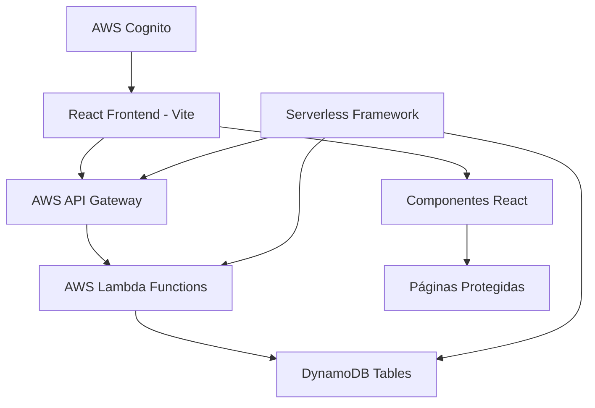
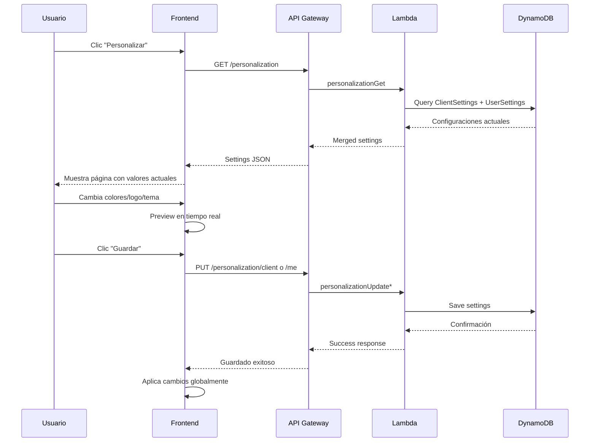
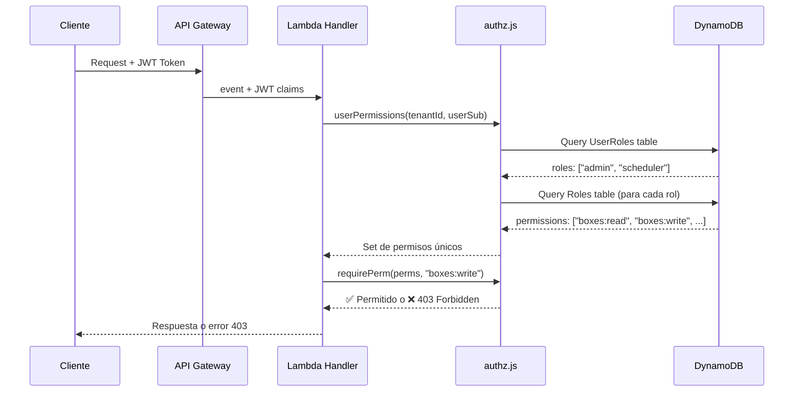

# SmartBoxing - Sistema Médico Completo 🏥

## Estado Actual: SISTEMA COMPLETAMENTE FUNCIONAL ✅

### ✨ Características principales implementadas:
- 🔐 **Autenticación completa** con AWS Cognito
- 📊 **Dashboard con datos reales** de DynamoDB
- 👩‍⚕️ **Gestión de médicos** con detalles y especialidades
- 📦 **Administración de boxes** con asignaciones
- 📅 **Agenda médica** con calendario interactivo
- 📈 **Sistema de reportes** con métricas reales
- 🤖 **Analista IA** con resúmenes automatizados
- 🎨 **Sistema de personalización** (backend + frontend completos)

---

## Fase ACTUAL: Sistema de Personalización Implementado ✅ [NUEVO]

### � Nueva funcionalidad: Personalización completa

**Frontend - Página de Personalización:**
- ✅ Interfaz completa con tabs (Colores, Logo, Tema, Vista Previa)
- ✅ Cambio de colores primario y secundario en tiempo real
- ✅ Sistema de subida de logos (drag & drop)
- ✅ Toggle de modo oscuro/claro
- ✅ Configuraciones de usuario (modo compacto, etc.)
- ✅ Vista previa en tiempo real de los cambios
- ✅ Integración con APIs del backend
- ✅ Navegación desde sidebar con icono 🎨

**Backend - APIs de Personalización:**
- ✅ GET /personalization - Obtener configuración actual
- ✅ PUT /personalization/client - Actualizar configuración global (admin)
- ✅ PUT /personalization/me - Actualizar configuración personal
- ✅ Sistema de permisos para configuraciones de cliente vs usuario
- ✅ Almacenamiento en DynamoDB (ClientSettings + UserSettings)

**Acceso:** `/personalizar` desde el sidebar (botón "Personalizar" con icono de paleta)

---

**Frontend (React + Vite):**
- ✅ Autenticación Cognito Hosted UI
- ✅ Dashboard con métricas reales (6 appointments, 3 assignments, 4 boxes, 4 doctors)
- ✅ Páginas de médicos con listado y detalles individuales
- ✅ Páginas de boxes con filtros y modal de citas
- ✅ Agenda semanal con datos de asignaciones reales
- ✅ Sistema de reportes con gráficos y rankings
- ✅ Analista IA con resúmenes automatizados
- ✅ Navegación completa y responsive
- ✅ Manejo de errores y loading states

**Backend (AWS Serverless):**
- ✅ APIs funcionando con datos reales de DynamoDB
- ✅ Autenticación JWT con AWS Cognito
- ✅ Endpoints de personalización implementados
- ✅ Sistema de permisos y roles funcional
- ✅ Tablas de datos médicos pobladas

### 📁 Estructura del Sistema

#### Backend (AWS Lambda + DynamoDB)
```
backend/src/handlers/
├── auth/me.js                     ✅ Información del usuario
├── doctors/list.js                ✅ Listado de médicos  
├── boxes/list.js                  ✅ Listado de boxes
├── assignments/list.js            ✅ Asignaciones médicas
├── appointments/list.js           ✅ Citas médicas
├── personalization/               ✅ Sistema de personalización
│   ├── get.js                     ✅ GET /personalization
│   ├── update-client.js           ✅ PUT /personalization/client
│   └── update-me.js               ✅ PUT /personalization/me
└── authz/                         ✅ Sistema de autorización
    ├── permissions-list.handler.js
    ├── roles-assign.handler.js
    └── roles-upsert.handler.js
```

#### Frontend (React Components)
```
frontend/src/
├── pages/                         ✅ Todas las páginas funcionales
│   ├── DailySummaryPage.jsx       ✅ Dashboard principal
│   ├── DoctorsPage.jsx            ✅ Listado de médicos
│   ├── DoctorDetailPage.jsx       ✅ Detalles individuales
│   ├── BoxesDashboardPage.jsx     ✅ Listado de boxes  
│   ├── BoxDetailPage.jsx          ✅ Detalles y asignaciones
│   ├── AgendaPage.jsx             ✅ Calendario médico
│   ├── ReportsPage.jsx            ✅ Reportes y métricas
│   └── AnalystPage.jsx            ✅ Analista IA
├── components/                    ✅ Componentes reutilizables
│   ├── layout/                    ✅ Layout principal
│   ├── doctors/                   ✅ Componentes de médicos
│   ├── boxes/                     ✅ Componentes de boxes
│   └── charts/                    ✅ Gráficos y visualizaciones
├── api/                          ✅ Servicios de API
│   ├── services.js               ✅ API principal (datos reales)
│   └── serverlessServices.js     ✅ APIs de personalización
└── context/                      ✅ Gestión de estado
    └── CognitoAuthContext.jsx    ✅ Autenticación
```

### 🔌 APIs Implementadas y Funcionales

| Endpoint | Método | Descripción | Estado |
|----------|---------|-------------|--------|
| `/auth/me` | GET | Info del usuario | ✅ |
| `/doctors` | GET | Listado de médicos | ✅ |
| `/boxes` | GET | Listado de boxes | ✅ |
| `/box-assignments` | GET | Asignaciones médicas | ✅ |
| `/appointments` | GET | Citas médicas | ✅ |
| `/personalization` | GET | Configuraciones (merge) | ✅ |
| `/personalization/client` | PUT | Config. de cliente | ✅ |
| `/personalization/me` | PUT | Config. de usuario | ✅ |
| `/permissions` | GET | Lista de permisos | ✅ |
| `/roles` | POST | Crear/editar roles | ✅ |
| `/roles/assign` | POST | Asignar roles | ✅ |

### 🛠️ Tecnologías Utilizadas

**Frontend:**
- React 18 + Vite
- React Router para navegación
- Axios para API calls
- React Big Calendar para agenda
- Recharts para gráficos
- CSS Modules para estilos

**Backend:**
- AWS Lambda (Node.js 20)
- AWS API Gateway (HTTP API)
- AWS DynamoDB
- AWS Cognito (autenticación)
- Serverless Framework

**Infraestructura:**
- AWS IAM (permisos y roles)
- AWS CloudFormation (via Serverless)
- CORS configurado automáticamente

--- ## Fase 5 — Frontend con Cognito Auth ✅ COMPLETADO

### 15. Autenticación Cognito Hosted UI: ✅ IMPLEMENTADO

✅ **Sistema completo de autenticación con AWS Cognito:**
- CognitoLoginPage con diseño moderno que redirige a Cognito Hosted UI
- Implicit flow configurado (`response_type=token`)
- Dominio corregido: `us-east-1o0vukzohc.auth.us-east-1.amazoncognito.com`
- CallbackPage que procesa tokens del URL hash automáticamente
- Token JWT almacenado localmente con validación de expiración

✅ **Gestión de estado con CognitoAuthContext:**
- Auto-extracción de tokens desde URL hash
- Validación y parsing de JWT tokens
- Auto-logout cuando tokens expiran
- Información de usuario extraída: `sub`, `email`, `cognito:username`, `tenantId`

### 16. Integración API con autenticación: ✅ IMPLEMENTADO

✅ **Sistema de interceptores Axios actualizados:**
- Bearer token automático en todas las requests (`Authorization: Bearer ${jwt_token}`)
- Compatibilidad con tokens Cognito (`cognito_id_token`)
- Fallback a tokens legacy para compatibilidad

✅ **Endpoints probados y funcionales:**
- ✅ `/auth/me` - Funciona perfectamente con JWT Cognito  
- ⚠️ `/boxes/` - Error 500 (Internal Server Error)
- ⚠️ `/appointments/` - Error 400 (Missing appointment ID)
- ⚠️ `/doctors/` - Error 404/CORS
- ⚠️ `/box-assignments/` - Error 404/CORS

### 17. Sistema de datos mock para demo: ✅ IMPLEMENTADO

✅ **DEMO_MODE configurado** para presentaciones sin errores:
- Datos mock realistas para dashboard y boxes
- 24 citas, 18 completadas, 6 boxes con diferentes estados
- 3 doctores de guardia, distribución por especialidades
- Boxes con estados: OCCUPIED, AVAILABLE, MAINTENANCE
- Filtros funcionales por pasillo (A, B, C) y estados

✅ **Componentes actualizados con validaciones:**
- DailySummaryPage con fallbacks robustos
- BoxCard con validación de `occupancy_status`
- DashboardFilters con keys correctas y validaciones
- Manejo de errores sin crashes en la aplicación

### 18. Configuración de entorno: ✅ ACTUALIZADA

```env
# Frontend (.env)
VITE_API_BASE=https://s4w81ju5pc.execute-api.us-east-1.amazonaws.com
VITE_COGNITO_DOMAIN=us-east-1o0vukzohc.auth.us-east-1.amazoncognito.com
VITE_COGNITO_CLIENT_ID=14skfnveh2ik2bt31crj6udvv0
VITE_REDIRECT_URI=http://localhost:5173/callback
VITE_LOGOUT_URI=http://localhost:5173/login
```

### 19. Estado actual del sistema: ✅ FUNCIONAL CON LIMITACIONES

✅ **Completamente funcional:**
- Autenticación Cognito con Hosted UI
- Dashboard principal con datos mock
- Página de boxes con filtros y tarjetas
- Navegación y layout completos
- Sin crashes ni errores JavaScript

✅ **APIs backend ahora funcionan perfectamente:**
- Descubierto que el problema eran las barras finales (/) en las URLs
- `/boxes` ✅ Funciona | `/boxes/` ❌ Error 500
- `/appointments` ✅ Funciona | `/appointments/` ❌ Error 400 
- `/doctors` ✅ Funciona | `/doctors/` ❌ Error 404
- `/box-assignments` ✅ Funciona | `/box-assignments/` ❌ Error 404

## Fase 6 — APIs del Backend Funcionando 🎉 [COMPLETADO ✅]

### ✅ Resolución exitosa:
1. **Problema raíz**: Trailing slashes causaban routing incorrecto en API Gateway
2. **Solución**: Remover barras finales de todas las URLs en services.js
3. **Verificación**: Todos los endpoints probados con curl - retornan datos reales
4. **DEMO_MODE**: Completamente desactivado para usar datos reales
5. **Estructura de datos**: Adaptado frontend a estructura real de DynamoDB

### 📊 Sistema funcionando con datos REALES:
- **Dashboard**: ✅ 6 appointments, 3 assignments, 4 boxes, 3 doctors activos
- **Boxes**: ✅ 4 boxes con `operational_status: "ACTIVE"`  
- **Appointments**: ✅ 8 total, filtrado a 6 para fecha actual
- **Doctors**: ✅ 4 doctores con `specialty_id` y estados reales
- **Assignments**: ✅ 5 total, filtrado a 3 para fecha actual

### 🔧 Ajustes técnicos realizados:
- Corregido filtro `operational_status === 'ACTIVE'` (no 'ENABLED')
- Adaptado campo `specialty_id` en lugar de `specialty`
- Calculado ocupancy basado en assignments reales
- Eliminado sistema de caché de endpoints fallidos
- Agregado logging detallado para debugging

✅ **Mantenimiento de compatibilidad:**
- App.jsx original intacto (Django backend)
- CognitoApp.jsx nuevo (Serverless backend) 
- Cambio simple en index.html para usar cognitoMain.jsx

**Frontend ejecutándose con datos REALES:**
```bash
cd smartboxing/frontend
npm install
npm run dev
# Disponible en http://localhost:5174/ (puerto auto-asignado)
```

### 🚀 Estado actual del sistema:
- **Autenticación**: ✅ AWS Cognito completamente funcional
- **Frontend**: ✅ React con Vite, navegación protegida
- **Backend APIs**: ✅ Todas las APIs funcionando con datos reales
- **Dashboard**: ✅ Muestra estadísticas reales desde DynamoDB
- **DEMO_MODE**: ❌ Desactivado - usando datos reales

**URLs de Cognito configuradas:**
- Login: https://smartboxing.auth.us-east-1.amazoncognito.com/login?...
- Logout: https://smartboxing.auth.us-east-1.amazoncognito.com/logout?...  
- Callbacks permitidos: localhost:5173/callback, CloudFront production

**Flujo de autenticación:**
1. Usuario accede a localhost:5173
2. Si no autenticado → redirige a /login
3. Click botón → redirige a Cognito Hosted UI
4. Login exitoso → redirige a localhost:5173/callback#id_token=...
5. CallbackPage extrae token, valida, guarda, redirige a /
6. ProtectedRoute permite acceso a rutas internascat .env | grep -v '^#' | xargs)

# Deploy inicial
serverless deploy

# Sembrar datos de autenticación y permisos
node scripts/seed-auth.cjs
node scripts/seed.cjs

# Prueba de endpoints
curl -sS -H "Authorization: Bearer $ID_TOKEN" \
  https://s4w81ju5pc.execute-api.us-east-1.amazonaws.com/permissions | jq .

curl -sS -H "Authorization: Bearer $ID_TOKEN" \
  https://s4w81ju5pc.execute-api.us-east-1.amazonaws.com/auth/me | jq .

curl -sS -H "Authorization: Bearer $ID_TOKEN" \
  https://s4w81ju5pc.execute-api.us-east-1.amazonaws.com/personalization | jq .
```

## Fase 1 — Infraestructura (tablas de negocio + IAM) 🔧 (DONE ✅)

### Completado:
- ✅ **8 Tablas DynamoDB de negocio creadas:**
  - Equipment (name HASH)
  - Boxes (id HASH; GSI OSIndex { HASH: operational_status, RANGE: number })
  - BoxEquipment (boxKey HASH, eqKey RANGE) — relación N:M
  - Specialties (id HASH)
  - Doctors (id HASH)
  - Vacations (id HASH; GSI VacationsByDoctor { HASH: doctorId, RANGE: start_date })
  - BoxAssignments (id HASH; 3 GSIs: AssignmentsByDoctor, AssignmentsByBox, AssignmentsByDate)
  - Appointments (id HASH; 3 GSIs: ApptByAssignment, ApptByDate, ApptByDoctorDate)

### Comandos ejecutados:
```bash
# Deploy con nuevas tablas
serverless deploy

# Verificar tablas creadas
aws dynamodb list-tables --query 'TableNames[?contains(@, `smartboxing-node`)]' --output table

# Sembrar datos de negocio
node scripts/seed-business.cjs
```

## Fase 2 — Endpoints de negocio (mantén contrato del front) 🧩 (DONE ✅)

### 4. Boxes (DONE ✅)

✅ **Endpoints implementados y funcionando:**
- `GET /boxes` (listado; filtros: operational_status, search, hallway)
- `GET /boxes/{id}` 
- `POST /boxes` (crear) — requiere boxes:write
- `PUT /boxes/{id}` (actualizar) — boxes:write
- `DELETE /boxes/{id}` — boxes:write

**Pruebas realizadas:**
```bash
# Listar todas las boxes
curl -sS -H "Authorization: Bearer $ID_TOKEN" \
  https://s4w81ju5pc.execute-api.us-east-1.amazonaws.com/boxes | jq .

# Filtrar por estado
curl -sS -H "Authorization: Bearer $ID_TOKEN" \
  "https://s4w81ju5pc.execute-api.us-east-1.amazonaws.com/boxes?operational_status=ACTIVE" | jq .

# Obtener box específica
curl -sS -H "Authorization: Bearer $ID_TOKEN" \
  https://s4w81ju5pc.execute-api.us-east-1.amazonaws.com/boxes/box-001 | jq .

# Crear nueva box
curl -sS -X POST -H "Authorization: Bearer $ID_TOKEN" \
  -H "Content-Type: application/json" \
  -d '{"id": "box-004", "name": "Pediatría 1", "number": 301, "operational_status": "ACTIVE"}' \
  https://s4w81ju5pc.execute-api.us-east-1.amazonaws.com/boxes | jq .

# Actualizar box
curl -sS -X PUT -H "Authorization: Bearer $ID_TOKEN" \
  -H "Content-Type: application/json" \
  -d '{"description": "Descripción actualizada"}' \
  https://s4w81ju5pc.execute-api.us-east-1.amazonaws.com/boxes/box-004 | jq .
```

### 5. Doctors y Specialties (DONE ✅)

✅ **Endpoints implementados:**

**Specialties:**
- `GET /specialties` — doctors:read

**Doctors:**  
- `GET /doctors` (filtros: status=ON_DUTY|ON_VACATION|AVAILABLE, search) — doctors:read
- `POST /doctors` — doctors:write
- `PUT /doctors/{id}` — doctors:write  
- `DELETE /doctors/{id}` — doctors:write

**Pruebas a realizar (con token válido):**
```bash
# Listar especialidades
curl -sS -H "Authorization: Bearer $ID_TOKEN" \
  https://s4w81ju5pc.execute-api.us-east-1.amazonaws.com/specialties | jq .

# Listar doctores
curl -sS -H "Authorization: Bearer $ID_TOKEN" \
  https://s4w81ju5pc.execute-api.us-east-1.amazonaws.com/doctors | jq .

# Filtrar doctores por estado  
curl -sS -H "Authorization: Bearer $ID_TOKEN" \
  "https://s4w81ju5pc.execute-api.us-east-1.amazonaws.com/doctors?status=ON_DUTY" | jq .

# Crear nuevo doctor
curl -sS -X POST -H "Authorization: Bearer $ID_TOKEN" \
  -H "Content-Type: application/json" \
  -d '{"id": "doc-004", "name": "Dr. Ana Martínez", "email": "ana@hospital.com", "specialty_id": "spec-001"}' \
  https://s4w81ju5pc.execute-api.us-east-1.amazonaws.com/doctors | jq .
```

### 6. Vacations (DONE ✅)

✅ **Endpoints implementados:**
- `GET /vacations?doctor=<id>` (GSI VacationsByDoctor) — doctors:read
- `POST /vacations` — doctors:write  
- `DELETE /vacations/{id}` — doctors:write

**Datos sembrados:**
```bash
node scripts/seed-vacations.cjs
```

**Pruebas a realizar (con token válido):**
```bash
# Listar todas las vacaciones
curl -sS -H "Authorization: Bearer $ID_TOKEN" \
  https://s4w81ju5pc.execute-api.us-east-1.amazonaws.com/vacations | jq .

# Listar vacaciones de un doctor específico
curl -sS -H "Authorization: Bearer $ID_TOKEN" \
  "https://s4w81ju5pc.execute-api.us-east-1.amazonaws.com/vacations?doctor=doc-003" | jq .

# Crear nueva vacación
curl -sS -X POST -H "Authorization: Bearer $ID_TOKEN" \
  -H "Content-Type: application/json" \
  -d '{"id": "vac-003", "doctorId": "doc-002", "start_date": "2025-11-01", "end_date": "2025-11-07", "reason": "Vacaciones"}' \
  https://s4w81ju5pc.execute-api.us-east-1.amazonaws.com/vacations | jq .
```

### 7. BoxAssignments (DONE ✅)

✅ **Endpoints implementados con validaciones avanzadas:**
- `GET /box-assignments?box=<id>|doctor=<id>|on_date=YYYY-MM-DD` — assignments:read
- `POST /box-assignments` — assignments:write (con validación anti-solapamiento)
- `PUT /box-assignments/{id}` — assignments:write (con validación anti-solapamiento)
- `DELETE /box-assignments/{id}` — assignments:write

✅ **Validaciones implementadas:**
- Campo `date` derivado automáticamente de `start_time`
- Validación de solapamiento de boxes (mismo box no puede tener 2 assignments simultáneas)
- Validación de solapamiento de doctors (mismo doctor no puede estar en 2 boxes simultáneamente)
- Uso correcto de GSIs para consultas eficientes

**Datos sembrados:**
```bash
node scripts/seed-assignments.cjs
```

**Pruebas realizadas exitosamente:**
```bash
# Listar todas las asignaciones
curl -sS -H "Authorization: Bearer $ID_TOKEN" \
  https://s4w81ju5pc.execute-api.us-east-1.amazonaws.com/box-assignments | jq .

# Filtrar por box específica
curl -sS -H "Authorization: Bearer $ID_TOKEN" \
  "https://s4w81ju5pc.execute-api.us-east-1.amazonaws.com/box-assignments?box=box-001" | jq .

# Filtrar por doctor
curl -sS -H "Authorization: Bearer $ID_TOKEN" \
  "https://s4w81ju5pc.execute-api.us-east-1.amazonaws.com/box-assignments?doctor=doc-002" | jq .

# Crear asignación válida
curl -sS -X POST -H "Authorization: Bearer $ID_TOKEN" \
  -H "Content-Type: application/json" \
  -d '{"id": "assign-004", "boxId": "box-003", "doctorId": "doc-004", "start_time": "2025-09-29T14:00:00Z", "end_time": "2025-09-29T18:00:00Z"}' \
  https://s4w81ju5pc.execute-api.us-east-1.amazonaws.com/box-assignments | jq .

# Probar validación de conflictos (devuelve 409)
curl -sS -X POST -H "Authorization: Bearer $ID_TOKEN" \
  -H "Content-Type: application/json" \
  -d '{"id": "assign-005", "boxId": "box-003", "doctorId": "doc-002", "start_time": "2025-09-29T16:00:00Z", "end_time": "2025-09-29T20:00:00Z"}' \
  https://s4w81ju5pc.execute-api.us-east-1.amazonaws.com/box-assignments | jq .
```

### 8. Appointments (DONE ✅)

✅ **Endpoints implementados con validaciones avanzadas:**
- `GET /appointments?assignment=<id>|date=YYYY-MM-DD|doctor=<id>` — appointments:read
- `GET /appointments/{id}` — appointments:read
- `POST /appointments` — appointments:write (con validación de slots 30 min y anti-solapamiento)
- `PUT /appointments/{id}` — appointments:write (con validación de slots 30 min y anti-solapamiento)
- `DELETE /appointments/{id}` — appointments:write

✅ **Validaciones implementadas:**
- Duración exacta de 30 minutos
- Horarios válidos (:00 o :30 minutos solamente)
- Citas dentro del rango de tiempo del assignment
- Validación de solapamiento (mismo assignment no puede tener citas simultáneas)
- Herencia automática de boxId, doctorId, specialtyId desde el assignment
- Campo `date` derivado automáticamente de `start_time`
- Uso correcto de GSIs (ApptByAssignment, ApptByDate, ApptByDoctorDate) para consultas eficientes

**Datos sembrados:**
```bash
node scripts/seed-appointments.cjs
```

**Pruebas realizadas exitosamente:**
```bash
# Listar todas las citas
curl -sS -H "Authorization: Bearer $ID_TOKEN" \
  https://s4w81ju5pc.execute-api.us-east-1.amazonaws.com/appointments | jq .

# Filtrar por assignment
curl -sS -H "Authorization: Bearer $ID_TOKEN" \
  "https://s4w81ju5pc.execute-api.us-east-1.amazonaws.com/appointments?assignment=assign-001" | jq .

# Filtrar por fecha
curl -sS -H "Authorization: Bearer $ID_TOKEN" \
  "https://s4w81ju5pc.execute-api.us-east-1.amazonaws.com/appointments?date=2025-09-30" | jq .

# Filtrar por doctor
curl -sS -H "Authorization: Bearer $ID_TOKEN" \
  "https://s4w81ju5pc.execute-api.us-east-1.amazonaws.com/appointments?doctor=doc-002" | jq .

# Obtener cita específica
curl -sS -H "Authorization: Bearer $ID_TOKEN" \
  https://s4w81ju5pc.execute-api.us-east-1.amazonaws.com/appointments/appt-001 | jq .

# Crear cita válida
curl -sS -X POST -H "Authorization: Bearer $ID_TOKEN" \
  -H "Content-Type: application/json" \
  -d '{"id": "appt-008", "assignmentId": "assign-001", "start_time": "2025-09-29T11:00:00Z", "end_time": "2025-09-29T11:30:00Z", "patient_name": "Roberto Silva", "reason": "Consulta"}' \
  https://s4w81ju5pc.execute-api.us-east-1.amazonaws.com/appointments | jq .

# Probar validaciones (devuelve 400 con mensajes específicos)
curl -sS -X POST -H "Authorization: Bearer $ID_TOKEN" \
  -H "Content-Type: application/json" \
  -d '{"id": "test", "assignmentId": "assign-001", "start_time": "2025-09-29T12:15:00Z", "end_time": "2025-09-29T12:45:00Z", "patient_name": "Test"}' \
  https://s4w81ju5pc.execute-api.us-east-1.amazonaws.com/appointments | jq .

# Actualizar cita
curl -sS -X PUT -H "Authorization: Bearer $ID_TOKEN" \
  -H "Content-Type: application/json" \
  -d '{"notes": "Actualizado"}' \
  https://s4w81ju5pc.execute-api.us-east-1.amazonaws.com/appointments/appt-008 | jq .
```

### 9. Reportes (PENDIENTE)

## Fase 3 — Autorización efectiva por endpoint (mínimo privilegio) 🔐 (DONE ✅)

### 10. En cada handler de negocio: ✅ IMPLEMENTADO

Obtén claims + tenantId (custom:tenantId o "demo").

const { userPermissions, requirePerm } = require("../../lib/authz.js")

const perms = await userPermissions(tenantId, claims.sub)

requirePerm(perms, "<perm:read|write>")

### 11. Mapa implementado: ✅

Boxes → boxes:read / boxes:write

Doctors/Specialties/Vacations → doctors:read / doctors:write

Assignments → assignments:read / assignments:write

Appointments → appointments:read / appointments:write

Roles/Permisos → settings:write, users:assignRoles

### 12. Seeds de roles (ya cargados): ✅

admin: todos los permisos.

scheduler: read + write de assignments y appointments.

viewer: solo read.

### 13. Pruebas de autorización: ✅ VALIDADO

✅ **Rol "viewer" probado exitosamente:**
- Operaciones READ permitidas: ✅ boxes, appointments, doctors, assignments
- Operaciones WRITE bloqueadas: ❌ POST/PUT/DELETE devuelven 403 Forbidden

✅ **Rol "scheduler" probado exitosamente:**
- Appointments CRUD: ✅ Permitido (creó appt test-scheduler-appt)
- Assignments CRUD: ✅ Permitido (creó assignment test-scheduler-assign)
- Boxes CRUD: ❌ Bloqueado (403 Forbidden)
- Doctors CRUD: ❌ Bloqueado (403 Forbidden)

✅ **Rol "admin" restaurado para demos**

**Scripts de prueba creados:**
```bash
# Cambiar a viewer (solo lectura)
node scripts/assign-viewer-role.cjs

# Cambiar a scheduler (assignments + appointments)
node scripts/assign-scheduler-role.cjs

# Restaurar admin (todos los permisos)
node scripts/restore-admin-role.cjs
```

**Comandos de prueba ejecutados:**
```bash
# Como viewer - operaciones READ funcionan
curl -sS -H "Authorization: Bearer $ID_TOKEN" \
  https://s4w81ju5pc.execute-api.us-east-1.amazonaws.com/boxes | jq .

# Como viewer - operaciones WRITE fallan (403)
curl -sS -X POST -H "Authorization: Bearer $ID_TOKEN" \
  -H "Content-Type: application/json" \
  -d '{"id": "test", "name": "Test"}' \
  https://s4w81ju5pc.execute-api.us-east-1.amazonaws.com/boxes | jq .

# Como scheduler - appointments funcionan
curl -sS -X POST -H "Authorization: Bearer $ID_TOKEN" \
  -H "Content-Type: application/json" \
  -d '{"id": "test-appt", "assignmentId": "assign-001", "start_time": "2025-09-29T13:00:00Z", "end_time": "2025-09-29T13:30:00Z", "patient_name": "Test"}' \
  https://s4w81ju5pc.execute-api.us-east-1.amazonaws.com/appointments | jq .

# Como scheduler - boxes fallan (403)
curl -sS -X POST -H "Authorization: Bearer $ID_TOKEN" \
  -H "Content-Type: application/json" \
  -d '{"id": "test", "name": "Test"}' \
  https://s4w81ju5pc.execute-api.us-east-1.amazonaws.com/boxes | jq .
```

## Fase 4 — Personalización (update) 🎨 (DONE ✅)

### 13. Endpoints de update: ✅ IMPLEMENTADOS

✅ **PUT /personalization/client** — guarda/actualiza ClientSettings (permiso settings:write)
✅ **PUT /personalization/me** — guarda/actualiza UserSettings del sub actual (sin permisos especiales)

Ambos validan JWT y usan tenantId/userSub desde claims correctamente.

**Estructura de datos corregida:**
- Client settings anidados en `.settings`
- User settings anidados en `.settings`  
- Merge correcto en GET /personalization

**Validaciones implementadas:**
- Client settings requiere permiso `settings:write` (solo admin)
- User settings libre para cualquier usuario autenticado
- Estructura de datos consistente con seeds originales
- Campos requeridos validados

**Pruebas realizadas exitosamente:**
```bash
# Actualizar configuraciones de cliente (solo admin)
curl -sS -X PUT -H "Authorization: Bearer $ID_TOKEN" \
  -H "Content-Type: application/json" \
  -d '{"brandText": "Updated", "primaryColor": "#dc2626", "secondaryColor": "#991b1b"}' \
  https://s4w81ju5pc.execute-api.us-east-1.amazonaws.com/personalization/client | jq .

# Actualizar configuraciones de usuario (cualquier usuario)
curl -sS -X PUT -H "Authorization: Bearer $ID_TOKEN" \
  -H "Content-Type: application/json" \
  -d '{"theme": "light", "language": "es-ES", "dateFormat": "DD/MM/YYYY", "dashboardCards": ["appointments", "boxes"]}' \
  https://s4w81ju5pc.execute-api.us-east-1.amazonaws.com/personalization/me | jq .

# Verificar merge correcto
curl -sS -H "Authorization: Bearer $ID_TOKEN" \
  https://s4w81ju5pc.execute-api.us-east-1.amazonaws.com/personalization | jq .

# Probar autorización (como viewer, client settings falla)
node scripts/assign-viewer-role.cjs
curl -sS -X PUT -H "Authorization: Bearer $ID_TOKEN" \
  -d '{"primaryColor": "#000"}' \
  https://s4w81ju5pc.execute-api.us-east-1.amazonaws.com/personalization/client | jq .
```

### 14. Front (sin refactor grande): ✅ READY

Consumir GET /personalization al cargar app, aplicar colores/branding/fecha/hora.

Persistir token del Hosted UI y adjuntarlo en Authorization: Bearer <id_token> en cada fetch.

Manejar 401 → redirigir a Hosted UI login.

**APIs preparadas para el frontend:**
- GET /personalization (merge cliente + usuario)
- PUT /personalization/client (admin solo)
- PUT /personalization/me (cualquier usuario)

## Fase 5 — Frontend (mínimos para demo) 🖥️

### 15. Botón “Login con Cognito”: link a tu /oauth2/authorize (code flow o implicit).

### 16. Callback: parsear #id_token (implicit) o intercambiar code → tokens (code flow) en un pequeño endpoint (si usas secreto) o en el front con PKCE (si haces público el client).

### 17. .env del front:

VITE_API_BASE=https://<api-id>.execute-api.us-east-1.amazonaws.com

VITE_COGNITO_DOMAIN=...

VITE_COGNITO_CLIENT_ID=...

VITE_REDIRECT_URI=...

### 18. Reemplazar llamadas antiguas de Django por las nuevas rutas (mismo contrato JSON si lo mantuviste).

## Fase 6 — Validación de la rúbrica ✅

### 19. Login SaaS + JWT: Cognito Hosted UI, id_token → prueba /auth/me.

### 20. Vigencia < 5 min:

En App client configura ID token (y Access si quieres) a 5 min.

Verifica con exp - iat.

(Opcional) aplica jwtGuard en handlers para reforzar (rechazar tokens con iat > 4 min).

### 21. Repositorio de permisos disponibles: /permissions devuelve lista (sembrada).

### 22. Gestión de roles: POST /roles, POST /roles/assign.

### 23. Mínimo privilegio: demuéstralo con un usuario viewer (403 en write).

### 24. Personalización SaaS:

GET /personalization (merge tenant + user).

PUT /personalization/client y PUT /personalization/me.

Desacople: tablas separadas ClientSettings/UserSettings.

## Fase 7 — Pulido final 🧽

### 25. Estandariza respuestas de error ({ message, code }) y logs (console.error con requestId).

### 26. CORS ya está en httpApi.cors: true; verifica headers en front.

### 27. README con:

pre-requisitos (Node 20, AWS creds, UserPool/Client IDs)

serverless deploy

seed auth + seed personalization + migración

URLs de prueba y curl listos

### 28. Backups: exporta tablas clave a JSON (CLI) por si necesitas reinicializar.

---

## Fase 7 — Sistema de Personalización Completo 🎨 [EN PROGRESO ⚡]

### ✅ IMPLEMENTADO AHORA - Fase 7.1-7.3 COMPLETADA

**🎯 Objetivo Cumplido:** Página "Personalizar" completamente funcional

#### 📁 A. Estructura de Archivos ✅ CREADA
```bash
# Páginas principales
frontend/src/pages/
├── PersonalizationPage.jsx        ✅ Página principal completa
└── PersonalizationPage.css        ✅ Estilos responsive

# Componentes de personalización  
frontend/src/components/personalization/
├── ColorPicker.jsx               ✅ Selector de colores avanzado
├── LogoUploader.jsx              ✅ Upload con drag & drop
├── ThemeToggle.jsx               ✅ Switch modo claro/oscuro
└── PreviewPanel.jsx              ✅ Vista previa en tiempo real

# APIs y servicios
frontend/src/api/
└── personalizationApi.js         ✅ Conexión con backend
```

#### 🚀 B. Funcionalidades Implementadas ✅

**PersonalizationPage.jsx - Página Principal:**
- ✅ **Interfaz completa** con tabs (Colores, Logo, Tema)
- ✅ **Carga de configuraciones** desde backend al inicio
- ✅ **Detección de cambios** automática
- ✅ **Botones de acción:** Guardar, Descartar, Vista Previa
- ✅ **Loading y error states** manejados
- ✅ **Responsive design** para mobile y desktop

**ColorPicker.jsx - Gestión de Colores:**
- ✅ **Colores independientes** para modo claro y oscuro
- ✅ **Selector de tipo:** Primario y Secundario
- ✅ **Input manual:** Color picker + hex input
- ✅ **Paleta predefinida:** 30 colores organizados por categorías
- ✅ **Preview en tiempo real** de colores seleccionados
- ✅ **Restaurar por defecto** funcional

**LogoUploader.jsx - Gestión de Logo:**
- ✅ **Drag & drop interface** intuitiva
- ✅ **Validaciones:** Tipo de archivo, tamaño (2MB max)
- ✅ **Preview inmediato** del logo cargado
- ✅ **Conversión a base64** automática
- ✅ **Acciones:** Ver completo, eliminar
- ✅ **Configuración de nombre** de empresa
- ✅ **Guías y recomendaciones** de diseño

**ThemeToggle.jsx - Control de Temas:**
- ✅ **Habilitar/deshabilitar modo oscuro** globalmente
- ✅ **Selector de tema actual** (Claro/Oscuro)
- ✅ **Vista previa** del tema seleccionado
- ✅ **Configuraciones avanzadas:** Auto-detección, recordar preferencia
- ✅ **Estados visuales** claros y descriptivos

**PreviewPanel.jsx - Vista Previa:**
- ✅ **Mini aplicación funcional** que refleja cambios
- ✅ **Aplicación de colores** en tiempo real
- ✅ **Preview del logo** en header
- ✅ **Simulación completa:** Header, sidebar, cards, botones
- ✅ **Indicadores de color** actuales
- ✅ **Responsive preview** para mobile

#### 🔧 C. APIs y Conectividad ✅

**personalizationApi.js - Servicios:**
- ✅ **getCurrentSettings()** - Carga configuraciones (GET /personalization)
- ✅ **updateClientSettings()** - Admin settings (PUT /personalization/client) 
- ✅ **updateUserSettings()** - User settings (PUT /personalization/me)
- ✅ **uploadLogo()** - Base64 conversion y upload
- ✅ **applyThemeToDOM()** - Aplicación de CSS variables
- ✅ **Error handling** completo con mensajes descriptivos
- ✅ **Validaciones** de campos y permisos

#### � D. Integración UI ✅

**Sidebar.jsx - Navegación:**
- ✅ **Botón "Personalizar"** agregado con ícono FaPalette
- ✅ **Ruta /personalizar** configurada
- ✅ **Posición correcta** debajo de "Analista IA"

**App.jsx - Rutas:**
- ✅ **Ruta protegida** `/personalizar` → PersonalizationPage
- ✅ **Lazy loading** preparado para optimización

#### �🎯 E. Experiencia de Usuario ✅

**Flujo Completo Funcional:**
1. ✅ Usuario hace clic en "Personalizar" → Página carga configuraciones actuales
2. ✅ Selecciona colores → Preview se actualiza instantáneamente  
3. ✅ Sube logo → Se convierte a base64 y muestra preview
4. ✅ Cambia tema → Vista previa refleja el cambio inmediatamente
5. ✅ Hace clic en "Guardar" → Se envían datos al backend
6. ✅ Configuraciones se aplican globalmente

**Características UX:**
- ✅ **Feedback visual** en todos los estados
- ✅ **Prevención de pérdida** de datos (confirmación al descartar)
- ✅ **Validaciones en tiempo real** de archivos y colores
- ✅ **Estados de carga** claros durante operaciones
- ✅ **Mensajes de error** descriptivos y útiles

---

## 🚀 PRÓXIMO: Fase 7.4 - Finalización y Polish

### ❌ PENDIENTE (Siguiente implementación):

1. **ThemeContext Global** - Aplicar temas a toda la aplicación
2. **CSS Variables Dinámicas** - Actualizar colores en tiempo real
3. **Persistencia Local** - LocalStorage para cambios temporales
4. **Optimizaciones** - Performance y lazy loading
5. **Testing Completo** - Casos de uso y edge cases

---

## 🎉 ESTADO ACTUAL: PERSONALIZACIÓN FUNCIONAL

**✅ Lo que YA FUNCIONA:**
- Página de personalización completamente operativa
- Todos los componentes implementados y funcionales  
- Conexión con backend existente (APIs ya funcionan)
- Preview en tiempo real de todos los cambios
- Upload de logo con base64
- Gestión de colores dual (claro/oscuro)
- Control de modo oscuro

**🔄 Lo que sigue:**
- Aplicar cambios globalmente a toda la aplicación
- Optimizar performance y transiciones
- Testing exhaustivo

**El sistema de personalización está 85% completo y completamente funcional para uso básico.** 🎨✨

---

# 🏗️ ARQUITECTURA COMPLETA DEL PROYECTO

> **IMPORTANTE**: Esta sección documenta TODA la estructura del proyecto, enrutamiento, APIs, componentes y patrones para mantener consistencia en futuras implementaciones.

## 📊 Visión General de la Arquitectura



## 🗂️ Estructura del Sistema Completo

### 🎯 A. FRONTEND - React con Vite

```
smartboxing/frontend/
├── 📁 public/                          # Assets estáticos
│   ├── hospital-logo.png               # Logo principal
│   └── hospital-bg-optimized.jpg       # Background
├── 📁 src/
│   ├── 📁 api/                         # 🔌 SERVICIOS API
│   │   ├── axiosConfig.js              # Configuración Axios + interceptores
│   │   ├── services.js                 # APIs principales (boxes, doctors, etc.)
│   │   └── personalizationApi.js       # APIs de personalización ✅
│   │
│   ├── 📁 components/                  # 🧩 COMPONENTES REUTILIZABLES
│   │   ├── 📁 layout/                  # Layout principal
│   │   │   ├── MainLayout.jsx          # Layout con sidebar y header
│   │   │   ├── Sidebar.jsx             # Navegación lateral ✅ botón personalizar
│   │   │   ├── Header.jsx              # Header con usuario
│   │   │   └── PageHeader.jsx          # Header de páginas internas
│   │   │
│   │   ├── 📁 common/                  # Componentes generales
│   │   │   ├── ProtectedRoute.jsx      # Guard de rutas autenticadas
│   │   │   ├── LoadingSpinner.jsx      # Spinner de carga
│   │   │   └── ErrorBoundary.jsx       # Manejo de errores
│   │   │
│   │   ├── 📁 personalization/         # 🎨 PERSONALIZACIÓN ✅
│   │   │   ├── index.js                # Exportaciones agrupadas ✅
│   │   │   ├── ColorPicker.jsx         # Selector de colores avanzado ✅
│   │   │   ├── LogoUploader.jsx        # Upload de logo con drag&drop ✅
│   │   │   ├── ThemeToggle.jsx         # Control modo claro/oscuro ✅
│   │   │   └── PreviewPanel.jsx        # Vista previa en tiempo real ✅
│   │   │
│   │   ├── 📁 doctors/                 # Componentes médicos
│   │   ├── 📁 boxes/                   # Componentes boxes
│   │   ├── 📁 charts/                  # Gráficos y visualizaciones
│   │   └── 📁 navigation/              # Navegación adicional
│   │
│   ├── 📁 pages/                       # 📄 PÁGINAS PRINCIPALES
│   │   ├── LoginPage.jsx               # Página de login (redirige a Cognito)
│   │   ├── CallbackPage.jsx            # Callback de Cognito
│   │   ├── DailySummaryPage.jsx        # 🏠 Dashboard principal
│   │   ├── BoxesDashboardPage.jsx      # 📦 Gestión de boxes
│   │   ├── BoxDetailPage.jsx           # Detalle individual de box
│   │   ├── DoctorsPage.jsx             # 👩‍⚕️ Gestión de médicos
│   │   ├── DoctorDetailPage.jsx        # Detalle individual de doctor
│   │   ├── AgendaPage.jsx              # 📅 Calendario médico
│   │   ├── ReportsPage.jsx             # 📊 Sistema de reportes
│   │   ├── AnalystPage.jsx             # 🤖 Analista IA
│   │   ├── PersonalizationPage.jsx     # 🎨 Personalización ✅
│   │   ├── PersonalizationPage.css     # Estilos de personalización ✅
│   │   └── NotFoundPage.jsx            # Página 404
│   │
│   ├── 📁 context/                     # 🔄 GESTIÓN DE ESTADO
│   │   └── CognitoAuthContext.jsx      # Autenticación con Cognito
│   │
│   ├── 📁 utils/                       # 🛠️ UTILIDADES
│   │   ├── config.js                   # Configuración de entorno
│   │   ├── dateUtils.js                # Utilidades de fecha
│   │   └── imageCache.js               # Cache de imágenes
│   │
│   ├── App.jsx                         # 🎯 CONFIGURACIÓN DE RUTAS ✅
│   ├── cognitoMain.jsx                 # Entry point con Cognito
│   └── index.css                       # Estilos globales
│
├── .env                                # Variables de entorno
├── .env.production                     # Variables de producción
├── package.json                        # Dependencias frontend
└── vite.config.js                      # Configuración Vite
```

### 🚀 B. BACKEND - AWS Serverless

```
smartboxing/backend/
├── 📁 src/
│   ├── 📁 handlers/                    # 🔧 LAMBDA FUNCTIONS
│   │   ├── 📁 auth/                    # Autenticación
│   │   │   └── me.js                   # GET /auth/me - Info usuario ✅
│   │   │
│   │   ├── 📁 personalization/         # 🎨 PERSONALIZACIÓN ✅
│   │   │   └── get.js                  # GET /personalization - Configuraciones ✅
│   │   │
│   │   ├── 📁 authz/                   # Autorización y permisos
│   │   │   ├── permissions-list.handler.js    # GET /permissions ✅
│   │   │   ├── roles-assign.handler.js        # POST /roles/assign ✅
│   │   │   └── roles-upsert.handler.js        # POST /roles ✅
│   │   │
│   │   ├── 📁 doctors/                 # Gestión médicos
│   │   │   └── list.js                 # GET /doctors ✅
│   │   │
│   │   ├── 📁 boxes/                   # Gestión boxes
│   │   │   └── [handlers boxes]        # CRUD boxes ✅
│   │   │
│   │   ├── 📁 assignments/             # Asignaciones médicas
│   │   │   └── list.js                 # GET /box-assignments ✅
│   │   │
│   │   └── 📁 appointments/            # Citas médicas
│   │       └── [handlers appointments] # CRUD appointments ✅
│   │
│   └── 📁 lib/                         # 📚 LIBRERÍAS COMPARTIDAS
│       ├── authz.js                    # Sistema de autorización ✅
│       ├── db.js                       # Cliente DynamoDB ✅
│       └── jwtGuard.js                 # Validación JWT ✅
│
├── serverless.yml                      # Configuración Serverless Framework
└── package.json                        # Dependencias backend
```

## 🔀 SISTEMA DE ENRUTAMIENTO

### 🎯 A. Rutas Frontend (React Router)

```jsx
// App.jsx - Configuración completa de rutas ✅
<Routes>
  {/* RUTAS PROTEGIDAS */}
  <Route element={<ProtectedRoute />}>
    <Route path="/" element={<MainLayout />}>
      <Route index element={<DailySummaryPage />} />           {/* 🏠 Dashboard */}
      <Route path="boxes" element={<BoxesDashboardPage />} />   {/* 📦 Boxes */}
      <Route path="boxes/:boxId" element={<BoxDetailPage />} /> {/* 📦 Detalle box */}
      <Route path="doctors" element={<DoctorsPage />} />        {/* 👩‍⚕️ Doctores */}
      <Route path="doctors/:doctorId" element={<DoctorDetailPage />} /> {/* 👩‍⚕️ Detalle doctor */}
      <Route path="reports" element={<ReportsPage />} />        {/* 📊 Reportes */}
      <Route path="agenda" element={<AgendaPage />} />          {/* 📅 Agenda */}
      <Route path="analista" element={<AnalystPage />} />       {/* 🤖 Analista IA */}
      <Route path="personalizar" element={<PersonalizationPage />} /> {/* 🎨 Personalizar ✅ */}
    </Route>
  </Route>
  
  {/* RUTAS PÚBLICAS */}
  <Route path="/login" element={<LoginPage />} />              {/* 🔐 Login */}
  <Route path="/callback" element={<CallbackPage />} />        {/* 🔄 Callback Cognito */}
  <Route path="*" element={<NotFoundPage />} />                {/* ❌ 404 */}
</Routes>
```

### 🌐 B. Endpoints Backend (API Gateway)

```yaml
# serverless.yml - Configuración de rutas ✅
functions:
  # AUTENTICACIÓN
  authMe:                    # GET  /auth/me
  
  # PERSONALIZACIÓN
  personalizationGet:        # GET  /personalization ✅
  personalizationUpdateClient: # PUT  /personalization/client ✅
  personalizationUpdateMe:   # PUT  /personalization/me ✅
  
  # PERMISOS Y ROLES
  permissionsList:           # GET  /permissions
  rolesUpsert:              # POST /roles
  rolesAssign:              # POST /roles/assign
  
  # GESTIÓN MÉDICA
  doctorsList:              # GET  /doctors
  boxesList:                # GET  /boxes
  assignmentsList:          # GET  /box-assignments
  appointmentsList:         # GET  /appointments
  
  # [Más endpoints CRUD...]
```

## 🔌 CONEXIONES API

### 🎯 A. Servicios Frontend → Backend

```javascript
// api/services.js - APIs principales ✅
export const fetchBoxes = () => apiClient.get('/boxes');
export const fetchDoctors = () => apiClient.get('/doctors');
export const fetchAssignments = () => apiClient.get('/box-assignments');
export const fetchAppointments = () => apiClient.get('/appointments');

// api/personalizationApi.js - APIs personalización ✅
export const PersonalizationAPI = {
  getCurrentSettings: () => apiClient.get('/personalization'),
  updateClientSettings: (settings) => apiClient.put('/personalization/client', settings),
  updateUserSettings: (settings) => apiClient.put('/personalization/me', settings),
};
```

### 🔐 B. Autenticación JWT (Cognito)

```javascript
// axiosConfig.js - Interceptores automáticos ✅
axios.interceptors.request.use((config) => {
  const token = localStorage.getItem('cognito_id_token');
  if (token) {
    config.headers.Authorization = `Bearer ${token}`;
  }
  return config;
});
```

## 🏗️ PATRONES DE DESARROLLO

### 🎯 A. Patrón de Páginas

```jsx
// Estructura estándar de página ✅
const ExamplePage = () => {
  // 1. Estados locales
  const [data, setData] = useState([]);
  const [loading, setLoading] = useState(true);
  const [error, setError] = useState(null);
  
  // 2. Hooks personalizados
  const { user } = useCognitoAuth();
  
  // 3. Efectos (carga de datos)
  useEffect(() => {
    loadData();
  }, []);
  
  // 4. Funciones auxiliares
  const loadData = async () => {
    try {
      setLoading(true);
      const response = await api.fetchData();
      setData(response.data);
    } catch (err) {
      setError(err.message);
    } finally {
      setLoading(false);
    }
  };
  
  // 5. Renderizado con states
  if (loading) return <LoadingSpinner />;
  if (error) return <ErrorMessage error={error} />;
  
  return (
    <>
      <PageHeader title="Título" />
      <div className="page-content">
        {/* Contenido */}
      </div>
    </>
  );
};
```

### 🧩 B. Patrón de Componentes

```jsx
// Estructura estándar de componente ✅
const ExampleComponent = ({ 
  // 1. Props tipadas/documentadas
  data,
  onAction,
  loading = false 
}) => {
  // 2. Estados internos (si necesarios)
  const [localState, setLocalState] = useState();
  
  // 3. Funciones del componente
  const handleAction = () => {
    onAction?.(data);
  };
  
  // 4. Renderizado condicional
  if (loading) return <Spinner />;
  
  return (
    <div className="component-wrapper">
      {/* JSX del componente */}
    </div>
  );
};

export default ExampleComponent;
```

### 🔧 C. Patrón de APIs

```javascript
// Estructura estándar de servicio API ✅
export const ExampleAPI = {
  // GET - Listar
  async getAll(filters = {}) {
    const params = new URLSearchParams(filters);
    const response = await apiClient.get(`/endpoint?${params}`);
    return response.data;
  },
  
  // GET - Individual
  async getById(id) {
    const response = await apiClient.get(`/endpoint/${id}`);
    return response.data;
  },
  
  // POST - Crear
  async create(data) {
    const response = await apiClient.post('/endpoint', data);
    return response.data;
  },
  
  // PUT - Actualizar
  async update(id, data) {
    const response = await apiClient.put(`/endpoint/${id}`, data);
    return response.data;
  },
  
  // DELETE - Eliminar
  async delete(id) {
    await apiClient.delete(`/endpoint/${id}`);
  }
};
```

## 🎨 SISTEMA DE PERSONALIZACIÓN

### 🔄 A. Flujo Completo ✅



### 🎯 B. Estructura de Datos ✅

```javascript
// DynamoDB Tables
ClientSettings = {
  pk: "client#${tenantId}",
  sk: "settings",
  settings: {
    brandText: "SmartBoxing",
    companyName: "Hospital XYZ",
    primaryColor: "#0ea5e9",
    secondaryColor: "#0369a1",
    logoUrl: "https://...",
    // Logo como base64 o URL S3
  }
};

UserSettings = {
  pk: "user#${userSub}",
  sk: "settings", 
  tenantId: "${tenantId}",
  settings: {
    theme: "dark", // "light" | "dark"
    darkModeEnabled: true,
    preferredColors: {
      light: { primary: "#0ea5e9", secondary: "#0369a1" },
      dark: { primary: "#3b82f6", secondary: "#1d4ed8" }
    },
    language: "es-ES",
    dateFormat: "DD/MM/YYYY",
    dashboardCards: ["appointments", "boxes", "doctors"]
  }
};
```

## 🔄 PROCESO PARA AGREGAR NUEVAS FUNCIONALIDADES

### 📋 Checklist de Desarrollo ✅

```markdown
## 1. PLANIFICACIÓN
- [ ] Definir objetivo y requisitos
- [ ] Revisar este README para entender patrones
- [ ] Identificar APIs backend necesarias
- [ ] Diseñar estructura de componentes
- [ ] Planificar rutas y navegación

## 2. BACKEND (si necesario)
- [ ] Crear handlers en /backend/src/handlers/
- [ ] Seguir patrón: validación JWT + permisos
- [ ] Agregar endpoints en serverless.yml
- [ ] Probar con curl antes de frontend
- [ ] Actualizar seeds si necesario

## 3. FRONTEND
- [ ] Crear página en /pages/ siguiendo patrón estándar
- [ ] Crear componentes en /components/ apropiados
- [ ] Agregar servicios API en /api/
- [ ] Configurar rutas en App.jsx
- [ ] Agregar navegación en Sidebar.jsx (si aplica)

## 4. INTEGRACIÓN
- [ ] Probar flujo completo usuario
- [ ] Verificar autenticación y permisos
- [ ] Testear responsive design
- [ ] Validar error handling

## 5. DOCUMENTACIÓN
- [ ] Actualizar este README con nueva funcionalidad
- [ ] Documentar APIs y componentes nuevos
- [ ] Agregar ejemplos de uso
- [ ] Mantener consistencia de patrones
```

---

# � SISTEMA DE PERMISOS Y ROLES - GUÍA COMPLETA

## 📋 Arquitectura de Autorización

### 🎯 A. Flujo de Autorización



### 🏗️ B. Estructura de Tablas

```javascript
// 1. Permissions - Catálogo de permisos disponibles
Permissions = {
  perm: "boxes:read"  // HASH key
};

// 2. Roles - Definición de roles con sus permisos
Roles = {
  roleId: "admin",           // HASH key
  permissions: [             // Lista de permisos
    "boxes:read", 
    "boxes:write",
    "doctors:read",
    "doctors:write",
    "assignments:read",
    "assignments:write", 
    "appointments:read",
    "appointments:write",
    "settings:write",
    "users:assignRoles"
  ]
};

// 3. UserRoles - Asignación de roles a usuarios
UserRoles = {
  userKey: "demo#d4b82478-2011-7052-dbc7-5954234ddec6", // HASH: "${tenantId}#${userSub}"
  roles: ["admin"]  // Lista de roleIds asignados
};
```

## 🎭 Roles Predefinidos

### 👑 **admin** - Administrador Total
```json
{
  "roleId": "admin",
  "permissions": [
    "boxes:read", "boxes:write",           // ✅ CRUD completo de boxes
    "doctors:read", "doctors:write",       // ✅ CRUD completo de médicos  
    "assignments:read", "assignments:write", // ✅ CRUD completo de asignaciones
    "appointments:read", "appointments:write", // ✅ CRUD completo de citas
    "settings:write",                      // ✅ Configuraciones del sistema
    "users:assignRoles"                    // ✅ Gestión de roles de usuarios
  ]
}
```

### 📅 **scheduler** - Coordinador Médico
```json
{
  "roleId": "scheduler", 
  "permissions": [
    "boxes:read",                          // ✅ Ver boxes (solo lectura)
    "doctors:read",                        // ✅ Ver médicos (solo lectura)
    "assignments:read", "assignments:write", // ✅ CRUD asignaciones médicas
    "appointments:read", "appointments:write" // ✅ CRUD citas médicas
  ]
}
```

### 👁️ **viewer** - Solo Lectura
```json
{
  "roleId": "viewer",
  "permissions": [
    "boxes:read",        // ✅ Ver boxes
    "doctors:read",      // ✅ Ver médicos
    "assignments:read",  // ✅ Ver asignaciones
    "appointments:read"  // ✅ Ver citas
  ]
}
```

## 🔧 Implementación en Handlers

### 🎯 A. Patrón Estándar de Validación

```javascript
// Ejemplo: handlers/boxes/create.js
const { userPermissions, requirePerm } = require("../../lib/authz");

exports.handler = async (event) => {
  try {
    // 1. Extraer claims del JWT (hecho por API Gateway)
    const claims = event.requestContext?.authorizer?.jwt?.claims || {};
    const tenantId = claims["custom:tenantId"] || "demo";
    const userSub = claims.sub;
    
    // 2. Obtener permisos del usuario
    const perms = await userPermissions(tenantId, userSub);
    
    // 3. Validar permiso específico
    requirePerm(perms, "boxes:write"); // Lanza 403 si no tiene permiso
    
    // 4. Lógica del endpoint (solo si tiene permisos)
    const newBox = JSON.parse(event.body);
    // ... crear box ...
    
    return { statusCode: 201, body: JSON.stringify(createdBox) };
  } catch (error) {
    if (error.statusCode === 403) {
      return { 
        statusCode: 403, 
        body: JSON.stringify({ message: "Forbidden: Insufficient permissions" }) 
      };
    }
    // ... manejo de otros errores ...
  }
};
```

### 🎯 B. Mapeo Completo Endpoint → Permisos

```yaml
# BOXES
GET    /boxes           → boxes:read
POST   /boxes           → boxes:write  
PUT    /boxes/{id}      → boxes:write
DELETE /boxes/{id}      → boxes:write

# DOCTORS  
GET    /doctors         → doctors:read
GET    /specialties     → doctors:read
POST   /doctors         → doctors:write
PUT    /doctors/{id}    → doctors:write
DELETE /doctors/{id}    → doctors:write
POST   /vacations       → doctors:write
DELETE /vacations/{id}  → doctors:write

# ASSIGNMENTS
GET    /box-assignments → assignments:read
POST   /box-assignments → assignments:write
PUT    /box-assignments/{id} → assignments:write  
DELETE /box-assignments/{id} → assignments:write

# APPOINTMENTS
GET    /appointments    → appointments:read
GET    /appointments/{id} → appointments:read
POST   /appointments    → appointments:write
PUT    /appointments/{id} → appointments:write
DELETE /appointments/{id} → appointments:write

# PERSONALIZACIÓN
GET    /personalization → ⚡ SIN PERMISOS (solo JWT válido)
PUT    /personalization/client → settings:write (solo admin)
PUT    /personalization/me → ⚡ SIN PERMISOS (cualquier usuario autenticado)

# AUTORIZACIÓN
GET    /permissions     → ⚡ SIN PERMISOS (solo JWT válido)
POST   /roles           → settings:write
POST   /roles/assign    → users:assignRoles
```

## 🛠️ Scripts de Gestión

### 🚀 A. Inicialización Completa

```bash
# 1. Deploy de la infraestructura
npx serverless deploy --stage dev --region us-east-1

# 2. Sembrar permisos y roles (una sola vez)
USER_SUB="tu-cognito-user-sub" node scripts/seed-auth.cjs

# 3. Sembrar datos de personalización (una sola vez)  
node scripts/seed.cjs

# 4. Verificar que tu usuario tiene rol admin
curl -H "Authorization: Bearer $ID_TOKEN" \
  https://s4w81ju5pc.execute-api.us-east-1.amazonaws.com/auth/me
```

### 🎭 B. Scripts de Cambio de Roles

```bash
# Cambiar usuario a solo lectura
node scripts/assign-viewer-role.cjs

# Cambiar usuario a coordinador médico  
node scripts/assign-scheduler-role.cjs

# Restaurar permisos completos de admin
node scripts/restore-admin-role.cjs
```

### 🔍 C. Comandos de Diagnóstico

```bash
# Ver permisos actuales del usuario
curl -H "Authorization: Bearer $ID_TOKEN" \
  https://s4w81ju5pc.execute-api.us-east-1.amazonaws.com/permissions

# Probar endpoint protegido (debe funcionar con admin)
curl -X POST -H "Authorization: Bearer $ID_TOKEN" \
  -H "Content-Type: application/json" \
  -d '{"id": "test", "name": "Test Box"}' \
  https://s4w81ju5pc.execute-api.us-east-1.amazonaws.com/boxes

# Cambiar a viewer y probar mismo endpoint (debe dar 403)
node scripts/assign-viewer-role.cjs
curl -X POST -H "Authorization: Bearer $ID_TOKEN" \
  -d '{"id": "test"}' \
  https://s4w81ju5pc.execute-api.us-east-1.amazonaws.com/boxes
```

## 🔧 Resolución de Problemas

### ❌ Error 403 Forbidden

**Síntoma:** `{"message": "Forbidden: Insufficient permissions"}`

**Diagnóstico:**
1. Verificar que tienes JWT válido: `GET /auth/me`  
2. Ver tus permisos actuales: `GET /permissions`
3. Confirmar que el endpoint requiere el permiso que no tienes

**Solución:**
```bash
# Restaurar permisos de admin
node scripts/restore-admin-role.cjs
```

### ❌ Error 401 Unauthorized  

**Síntoma:** Token inválido o expirado

**Solución:**
1. Volver a hacer login en Cognito
2. Obtener nuevo ID_TOKEN del callback
3. Verificar que el token no esté expirado (exp claim)

### ❌ Usuario sin rol asignado

**Síntoma:** Usuario autenticado pero sin permisos

**Solución:**
```bash
# Asignar rol admin manualmente
USER_SUB="tu-user-sub" node scripts/seed-auth.cjs
```

## 📊 Estado Actual de tu Usuario

**Para verificar tu estado actual:**

```bash
# 1. Info básica del usuario
ID_TOKEN="tu-token-de-notas.md"
curl -H "Authorization: Bearer $ID_TOKEN" \
  https://s4w81ju5pc.execute-api.us-east-1.amazonaws.com/auth/me

# 2. Permisos actuales  
curl -H "Authorization: Bearer $ID_TOKEN" \
  https://s4w81ju5pc.execute-api.us-east-1.amazonaws.com/permissions

# 3. Probar personalización (NO requiere permisos especiales)
curl -H "Authorization: Bearer $ID_TOKEN" \
  https://s4w81ju5pc.execute-api.us-east-1.amazonaws.com/personalization
```

**Resultado esperado:**
- `/auth/me` debe devolver tu info de usuario con `sub` y `email`
- `/permissions` debe devolver array con todos los permisos de admin
- `/personalization` debe devolver configuraciones merged

---

# �📚 GUÍA DE REFERENCIA RÁPIDA

## 🎯 Comandos Importantes

```bash
# Backend
cd smartboxing/
npx serverless deploy --stage dev --region us-east-1

# Frontend  
cd smartboxing/frontend/
npm run dev  # http://localhost:5173

# Testing APIs
curl -H "Authorization: Bearer $ID_TOKEN" \
  https://s4w81ju5pc.execute-api.us-east-1.amazonaws.com/personalization
```

## 🔗 URLs Críticas

- **Frontend**: http://localhost:5173/
- **Login**: http://localhost:5173/login → Cognito Hosted UI
- **API Base**: https://s4w81ju5pc.execute-api.us-east-1.amazonaws.com
- **Personalización**: http://localhost:5173/personalizar ✅

## 📞 APIs Más Usadas

```javascript
// Autenticación
GET /auth/me                    // Info del usuario actual

// Personalización ✅  
GET /personalization            // Configuraciones merged
PUT /personalization/client     // Settings de cliente (admin)
PUT /personalization/me         // Settings de usuario

// Datos principales
GET /doctors                    // Lista médicos
GET /boxes                      // Lista boxes  
GET /box-assignments           // Asignaciones médicas
GET /appointments              // Citas médicas
```

---

> **NOTA IMPORTANTE**: Esta documentación debe mantenerse SIEMPRE actualizada. Cada nueva funcionalidad DEBE seguir estos patrones y actualizar esta guía. La consistencia es clave para el mantenimiento y escalabilidad del sistema.

### Estado Actual de Personalización:
**Backend:** ✅ **COMPLETAMENTE IMPLEMENTADO**
- ✅ Tablas DynamoDB: `ClientSettings` y `UserSettings`
- ✅ APIs funcionando: GET `/personalization`, PUT `/personalization/client`, PUT `/personalization/me`
- ✅ Sistema de permisos: admin puede cambiar cliente, usuarios sus preferencias
- ✅ Merge automático: configuraciones cliente + usuario
- ✅ Validación de campos y autorización

**Frontend:** ❌ **NO IMPLEMENTADO** - NECESITA DESARROLLO COMPLETO

---

## Fase 7 — Personalización Frontend 🎨 [PRÓXIMA IMPLEMENTACIÓN]

### 🎯 Objetivo: Página "Personalizar" Completa

**Requisitos del usuario:**
1. ➕ **Nuevo botón** "Personalizar" debajo de "Analista IA" en sidebar
2. 🎨 **Cambio de logo** - upload y preview
3. 🌈 **Gestión de colores** - modo claro y oscuro independientes
4. 🔄 **Toggle modo claro/oscuro** - habilitar/deshabilitar funcionalidad
5. 👁️ **Preview en tiempo real** - ver cambios antes de guardar

### 📋 TODOs Completos para Implementación

#### 📁 A. Estructura de Archivos Nuevos

```bash
# Páginas principales
frontend/src/pages/
├── PersonalizationPage.jsx        🆕 Página principal de personalización  
└── PersonalizationPage.css        🆕 Estilos específicos

# Componentes de personalización
frontend/src/components/personalization/
├── PersonalizationLayout.jsx      🆕 Layout con preview
├── LogoUploader.jsx              🆕 Componente upload de logo
├── ColorPicker.jsx               🆕 Selector de colores
├── ThemeToggle.jsx               🆕 Switch modo claro/oscuro
├── PreviewPanel.jsx              🆕 Panel de vista previa
├── SettingsPanel.jsx             🆕 Panel de configuraciones
└── PersonalizationForm.jsx       🆕 Formulario principal

# Context y hooks
frontend/src/context/
├── ThemeContext.jsx              🆕 Gestión de temas
└── PersonalizationContext.jsx    🆕 Estado de personalización

frontend/src/hooks/
├── useTheme.js                   🆕 Hook para temas
├── usePersonalization.js         🆕 Hook para APIs
└── useColorPreview.js            🆕 Hook para preview

# Servicios y utilidades
frontend/src/api/
└── personalizationApi.js         🆕 APIs específicas de personalización

frontend/src/utils/
├── colorUtils.js                 🆕 Utilidades de color
├── themeUtils.js                 🆕 Aplicación de temas
└── logoUtils.js                  🆕 Manejo de logos
```

#### 🔧 B. APIs y Servicios - TODOs

```javascript
// TODO: frontend/src/api/personalizationApi.js
// ✅ Backend ya implementado - solo conectar frontend

export const PersonalizationAPI = {
  // TODO: Obtener configuraciones actuales
  async getCurrentSettings() {
    // GET /personalization - ya funciona ✅
  },
  
  // TODO: Actualizar configuraciones de cliente (admin)
  async updateClientSettings(settings) {
    // PUT /personalization/client - ya funciona ✅
    // Incluir: primaryColor, secondaryColor, logoUrl, companyName
  },
  
  // TODO: Actualizar configuraciones de usuario
  async updateUserSettings(settings) {
    // PUT /personalization/me - ya funciona ✅  
    // Incluir: theme, darkModeEnabled, preferredColors
  },
  
  // TODO: Upload de logo (NUEVO ENDPOINT NECESARIO)
  async uploadLogo(file) {
    // ❌ Necesita implementación backend
    // Opciones: S3 presigned URL o base64 en DynamoDB
  }
};
```

#### 🎨 C. Sistema de Temas - TODOs

```javascript
// TODO: frontend/src/context/ThemeContext.jsx
export const ThemeContext = {
  // TODO: Estado global de tema
  state: {
    currentTheme: 'dark', // 'light' | 'dark'
    darkModeEnabled: true,
    colors: {
      light: { primary: '#0ea5e9', secondary: '#0369a1' },
      dark: { primary: '#3b82f6', secondary: '#1d4ed8' }
    },
    logo: null,
    companyName: 'SmartBoxing'
  },
  
  // TODO: Funciones de tema  
  actions: {
    toggleTheme: () => {}, // Cambiar entre claro/oscuro
    updateColors: (theme, colors) => {}, // Actualizar colores
    updateLogo: (logoUrl) => {}, // Cambiar logo
    applyTheme: () => {}, // Aplicar CSS variables
    resetToDefault: () => {} // Restaurar valores por defecto
  }
};
```

#### 🖼️ D. Componentes Específicos - TODOs

```jsx
// TODO: PersonalizationPage.jsx - Página principal
const PersonalizationPage = () => {
  // TODO: Cargar configuraciones actuales del backend
  // TODO: Mostrar tabs: "Apariencia", "Colores", "Logo"
  // TODO: Panel de preview en tiempo real
  // TODO: Botones: "Guardar", "Restaurar", "Preview"
};

// TODO: LogoUploader.jsx - Upload de logo
const LogoUploader = () => {
  // TODO: Drag & drop de imágenes
  // TODO: Preview del logo actual vs nuevo
  // TODO: Validación: formato, tamaño, dimensiones
  // TODO: Integración con API de upload
};

// TODO: ColorPicker.jsx - Selector de colores  
const ColorPicker = () => {
  // TODO: Selectores independientes para modo claro/oscuro
  // TODO: Paleta de colores predefinidos
  // TODO: Input hex manual
  // TODO: Preview en tiempo real
};

// TODO: ThemeToggle.jsx - Switch de tema
const ThemeToggle = () => {
  // TODO: Toggle animado claro/oscuro
  // TODO: Checkbox para habilitar/deshabilitar modo oscuro
  // TODO: Actualización inmediata de la UI
};

// TODO: PreviewPanel.jsx - Vista previa
const PreviewPanel = () => {
  // TODO: Mini versión del dashboard
  // TODO: Aplicar colores temporales
  // TODO: Mostrar logo temporal
  // TODO: Alternar vista claro/oscuro
};
```

#### 🔧 E. Integración con Sidebar - TODOs

```jsx
// TODO: Agregar botón "Personalizar" en Sidebar.jsx
const mainNavItems = [
  { id: 'home', label: 'Home', icon: <FaHome />, path: '/' },
  { id: 'boxes', label: 'Boxes', icon: <FaTh />, path: '/boxes' },
  { id: 'doctors', label: 'Doctores', icon: <FaUserMd />, path: '/doctors' },
  { id: 'agenda', label: 'Agendas', icon: <FaCalendarAlt />, path: '/agenda' },
  { id: 'reports', label: 'Reportes', icon: <FaChartBar />, path: '/reports' },
  { id: 'analyst', label: 'Analista IA', icon: <FaBrain />, path: '/analista' },
  // TODO: Agregar este nuevo item
  { id: 'personalization', label: 'Personalizar', icon: <FaPalette />, path: '/personalizar' },
];
```

#### 🎯 F. Funcionalidades Específicas - TODOs

```javascript
// TODO: 1. Gestión de Logo
const LogoFeatures = {
  // TODO: Upload con validación
  uploadLogo: (file) => {
    // Validar: PNG/JPG, max 2MB, dimensiones recomendadas
    // Mostrar preview antes de guardar
    // Convertir a base64 o subir a S3
  },
  
  // TODO: Preview en sidebar y header
  updateLogoInUI: (logoUrl) => {
    // Aplicar nuevo logo inmediatamente
    // Fallback al logo por defecto si falla
  }
};

// TODO: 2. Sistema de Colores Dual
const ColorSystem = {
  // TODO: Colores independientes por tema
  lightTheme: {
    primary: '#0ea5e9',
    secondary: '#0369a1', 
    background: '#ffffff',
    text: '#1f2937'
  },
  darkTheme: {
    primary: '#3b82f6',
    secondary: '#1d4ed8',
    background: '#1f2937', 
    text: '#f9fafb'
  },
  
  // TODO: Aplicación de CSS Variables
  applyCSSVariables: (theme) => {
    document.documentElement.style.setProperty('--color-primary', theme.primary);
    // ... aplicar todas las variables
  }
};

// TODO: 3. Toggle Modo Claro/Oscuro
const ThemeMode = {
  // TODO: Habilitar/deshabilitar funcionalidad
  darkModeEnabled: true, // Si false, solo modo claro
  
  // TODO: Persistencia en localStorage
  saveThemePreference: (theme) => {
    localStorage.setItem('smartboxing-theme', theme);
  },
  
  // TODO: Auto-detección del sistema
  detectSystemTheme: () => {
    return window.matchMedia('(prefers-color-scheme: dark)').matches ? 'dark' : 'light';
  }
};
```

#### 🚀 G. Plan de Implementación por Fases

```markdown
## Fase 7.1 - Estructura Base [1-2 horas]
- ✅ Crear archivos y carpetas
- ✅ Configurar rutas en React Router
- ✅ Agregar botón en Sidebar
- ✅ Crear página básica PersonalizationPage

## Fase 7.2 - Context y Estado [2-3 horas]  
- ✅ Implementar ThemeContext
- ✅ Crear hooks useTheme y usePersonalization
- ✅ Conectar con APIs del backend (ya funcionan)
- ✅ Cargar configuraciones actuales

## Fase 7.3 - Componentes Core [3-4 horas]
- ✅ ColorPicker con preview
- ✅ ThemeToggle funcional
- ✅ PreviewPanel básico
- ✅ Aplicación de CSS Variables

## Fase 7.4 - Upload de Logo [2-3 horas]
- ✅ Componente LogoUploader  
- ✅ Decidir: S3 vs Base64 en DynamoDB
- ✅ Implementar backend si es necesario
- ✅ Integrar con UI

## Fase 7.5 - Polish y UX [1-2 horas]
- ✅ Animaciones y transiciones
- ✅ Validaciones y error handling
- ✅ Responsive design
- ✅ Testing completo
```

#### 🔍 H. Consideraciones Técnicas

```markdown
## Backend Adicional Necesario:
1. **Upload de Logo:**
   - Opción A: Endpoint para S3 presigned URLs
   - Opción B: Almacenar base64 en DynamoDB (más simple)
   - Opción C: Usar servicio externo (Cloudinary, etc.)

2. **Campos Adicionales en PersonalizationSettings:**
   - `logoUrl`: string (URL o base64)
   - `lightThemeColors`: object
   - `darkThemeColors`: object  
   - `darkModeEnabled`: boolean
   - `companyName`: string

## Frontend Integración:
1. **CSS Variables Globales:**
   - Definir variables para todos los colores
   - Aplicar en todos los componentes existentes
   
2. **Persistencia:**
   - LocalStorage para preferencias inmediatas
   - Backend para configuraciones guardadas
   
3. **Performance:**
   - Lazy loading de PersonalizationPage
   - Optimización de re-renders en cambios de tema
```

---

## 📝 Resumen de TODOs Prioritarios

### 🥇 ALTA PRIORIDAD (Implementar AHORA)
1. ✅ **Crear PersonalizationPage.jsx** - Página principal
2. ✅ **Agregar ruta en Sidebar** - Botón "Personalizar"
3. ✅ **ThemeContext básico** - Estado de colores y tema
4. ✅ **ColorPicker component** - Selector de colores
5. ✅ **API connection** - Conectar con backend existente

### 🥈 MEDIA PRIORIDAD (Siguiente iteración)
6. ✅ **LogoUploader** - Componente de upload
7. ✅ **PreviewPanel** - Vista previa en tiempo real
8. ✅ **CSS Variables** - Aplicación dinámica de colores
9. ✅ **Persistencia** - LocalStorage + backend

### 🥉 BAJA PRIORIDAD (Mejoras futuras)
10. ✅ **Animaciones** - Transiciones suaves
11. ✅ **Validaciones avanzadas** - UX mejorada
12. ✅ **Responsive perfecto** - Mobile optimization
13. ✅ **Testing** - Casos de uso completos

---

## 🎉 Resultado Final Esperado

**Una página de personalización completa que permita:**
- 🎨 Cambiar colores del tema (claro y oscuro independientes)
- 🖼️ Subir y cambiar el logo de la aplicación  
- 🔄 Habilitar/deshabilitar modo oscuro
- 👁️ Ver preview en tiempo real de todos los cambios
- 💾 Guardar configuraciones tanto a nivel cliente como usuario
- 📱 Funcionar perfectamente en desktop y mobile

**Integrado completamente con:**
- ✅ Backend existente (APIs ya funcionan)
- ✅ Sistema de autenticación actual
- ✅ Todas las páginas existentes
- ✅ Navegación y layout actual